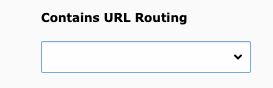
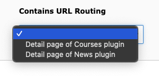

# TYPO3 Extension: My Configurable Routes
  * Description: TYPO3 Extension: Configurable Route Type
  * Extension key: my_configurable_routes

Configure your specific named routes in the backend for page setup.

## Example Configuration
Add the following snippet to your Site config.yaml
 
```yaml
routeEnhancers:
  ExampleDetailPlugin:
    type: PluginConfigurableByPage # or ExtbaseConfigurableByPage
    configurable:
      key: example # unique for this route enhancer
      label: 'Detail page of Example plugin' # or LLL:EXT: reference
      icon: your_registered_icon # or empty when not available
    routePath: '/{slug}'
    namespace: tx_exampleplugin_detail
    _arguments:
      slug: article
    aspects:
      slug:
        type: PersistedPatternMapper
        tableName: 'tx_exampleplugin_domain_model_article'
        routeFieldPattern: '^(?P<uid>\d+)'
        routeFieldResult: '{uid}-{path_segment}'
```
This is now available as a page property under `Appearance` tab.
It is added to the palette `Use as Container` with the label `Contains URL Routing`.

For additional configuration see:
- PluginConfigurableByPage: https://docs.typo3.org/permalink/t3coreapi:routing-plugin-enhancer
- ExtbaseConfigurableByPage: https://docs.typo3.org/permalink/t3coreapi:routing-extbase-plugin-enhancer

**_Screenshots:_**



 
